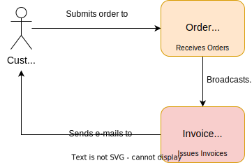

# Enis' Reactive Playground

## Resilience

### Use Case 1: Invoice E-Mails
**GIVEN** The user has selected picked some items on it basket

**WHEN** The user submits the order items and its email to the system

**THEN** Will system will accept the order and issue an invoice to the user via e-mail

#### Non functional requirements
* Invoicing may happen asynchronously
* Sending out Invoice e-mail should be guaranteed

#### Failure scenarios
* 

#### Solutions with various Tools
* ***Solution 1: Spring Boot - JPA sample***
    * *a) [Simple retry](https://github.com/enisspahi/spring-boot-jpa-resilience-sample)*:  Invoice e-mail delivery retried during mail sending failures, however messages are lost on service restarts.  
    * *b) [Event streaming with at-least-once-delivery](https://github.com/enisspahi/spring-boot-jpa-resilience-sample/tree/alod):* Invoice e-mail delivery retried even after service restarts.
* ***Solution 2: [Spring Boot - MongoDB Change streams with at-least-once-delivery](https://github.com/enisspahi/spring-boot-mongodb-changestreams-sample)***: Invoice e-mail delivery based on MongoDB Change Streams. Invoice e-mail delivery retried even after service restarts.
* ***Solution 3: [Akka - Event Sourcing and CQRS](https://github.com/enisspahi/akka-eventsourcing-cqrs-sample)***: Orders received and emitted as events (Event Sourcing), Invoices issued based on event streaming (CQRS). Akka projection API provides exactly-once-delivery guarantee.   

**Evaluation:**
* `1.a` has an easy to implement, however retries are not restart-proof. 
* On `1.b` and `2` multiple instance of the service would create multiple `InvoiceProcessor` streams which may cause duplicate e-mails, furthermore inconsistent stream behavior. Configuration should be adjusted to ensure single instance of this stream (Static configuration, K8 Stateful set, etc).
* `3` provides exactly-once-delivery and provides one instance at a time. However, Akka has relatively higher complexity.     

**Alternative solutions:**

* **Messaging** 
  * **Dual Writes:** `OrderService` atomically stores the order and emits `OrderReceived` message to Kafka (or an alternative message queue).
  * **Change Data Capture (CDC):** `OrderService` stores the order. Kafka Connect with Debezium captures the data and writes to Kafka.
  * **Kafka via CQRS:** `OrderService` stores the order. Data are streamed as messages to Kafka similarly like `1.b`, `2`, `3`.
* **Scheduled Batches**
  * `@Scheduled`
  * ...

